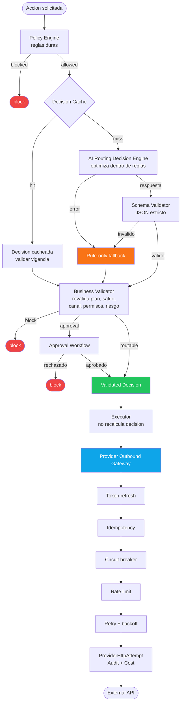

# Safe Automation Control Plane

Arquitectura open-source para automatizaciones seguras: un motor de decisiones
**rule-first** con IA y un gateway outbound para ejecutar integraciones externas
con idempotencia, limites, auditoria y control de costos.

La idea central:

```txt
Las reglas definen que esta permitido.
La IA optimiza dentro de lo permitido.
La plataforma valida antes de ejecutar.
El gateway outbound controla las llamadas al mundo externo.
```

Este repositorio une dos patrones complementarios:

- **AI Routing Decision Engine**: decide si una accion puede avanzar, con que
  riesgo, costo, aprobacion y estrategia.
- **Provider Outbound Gateway**: ejecuta llamadas a APIs externas de forma
  idempotente, limitada, medible y auditable.

Juntos forman una capa de control para plataformas que automatizan acciones
con impacto real: mensajes, publicaciones, campanias, marketplaces, pagos,
email, OCR, agentes IA, workflows internos o integraciones SaaS.

## Por que existe

Cuando una plataforma combina IA, automatizacion y APIs externas aparecen
fallos que no se resuelven solo con prompts ni solo con un API gateway.

Ejemplos:

- la IA puede recomendar una accion no permitida;
- una accion puede generar costo variable;
- un timeout puede duplicar una llamada externa;
- un token vencido puede romper un flujo completo;
- un provider caido puede disparar reintentos en cascada;
- un tenant puede exceder rate limits;
- una accion puede requerir aprobacion humana;
- una decision puede expirar antes de ejecutarse;
- sin auditoria no se sabe por que algo se ejecuto;
- sin idempotencia no se puede reintentar con confianza.

La solucion es separar decision, validacion y ejecucion externa.

## La regla principal

Nunca:

```txt
AI Router -> Executor directo
AI Router -> API externa directo
Modulo de negocio -> Provider externo directo
```

Siempre:

```txt
Solicitud de accion
  -> Policy Engine
  -> AI Routing Decision Engine
  -> Schema Validator
  -> Business Validator
  -> Decision validada
  -> Executor
  -> Provider Outbound Gateway
  -> API externa
```

## Arquitectura completa



## Los dos componentes

### 1. AI Routing Decision Engine

Patron para tomar decisiones con IA sin dejar que la IA tenga la ultima palabra.

Responsabilidades:

- ejecutar reglas duras antes de llamar al modelo;
- evitar IA cuando una regla o cache alcanza;
- elegir proveedor/modelo segun costo, plan y riesgo;
- validar salida con JSON Schema estricto;
- revalidar con Business Validator;
- usar fallback conservador;
- pedir aprobacion humana cuando corresponde;
- persistir decisiones auditables;
- medir tokens y costo IA;
- operar en simulation, advisory, shadow o enforced.

No debe:

- ejecutar envios;
- llamar APIs externas;
- ignorar reglas duras;
- aceptar output IA sin validar;
- recibir tokens o secretos;
- obedecer instrucciones dentro de contenido no confiable.

Documento recomendado:

- [AI Routing Decision Engine](https://github.com/cristiandkzk/ai-routing-decision-engine-)

### 2. Provider Outbound Gateway

Patron para centralizar llamadas salientes a APIs externas.

Responsabilidades:

- resolver cuentas conectadas;
- refrescar tokens;
- construir requests desde manifests;
- aplicar idempotencia;
- aplicar circuit breaker;
- aplicar rate limit por tenant/provider;
- ejecutar retry con backoff;
- persistir attempts;
- registrar costos;
- devolver errores uniformes;
- evitar llamadas directas a providers desde modulos de negocio.

No debe:

- decidir si una accion esta permitida;
- saltarse una decision validada;
- exponer tokens;
- duplicar acciones ante reintentos;
- ocultar fallos sin attempt/auditoria.

Documento recomendado:

- [Provider Outbound Gateway](https://github.com/cristiandkzk/Provider-Outbound-Gateway)

## Como se relacionan

El Decision Engine responde:

```txt
Esta accion puede avanzar?
Con que riesgo?
Requiere aprobacion?
Que canal o estrategia conviene?
Que costo estimado tiene?
Por cuanto tiempo es valida la decision?
```

El Outbound Gateway responde:

```txt
Como llamo al provider externo sin duplicar, romper rate limits,
usar tokens vencidos o perder auditoria?
```

La relacion correcta:

```txt
Decision Engine -> produce decision validada
Executor -> consume decision validada
Outbound Gateway -> ejecuta llamada externa controlada
```

El executor no deberia recalcular la decision. Si detecta que la decision
expiro o que cambio un dato critico, debe pedir una nueva decision.

## Que problemas evita

### Acciones no autorizadas

El Policy Engine y el Business Validator bloquean antes de ejecutar.

### Costos inesperados

El Decision Engine estima costo y el gateway registra costo externo.

### Duplicados

El gateway usa idempotency keys y attempts persistidos.

### Providers caidos

El gateway usa circuit breaker, retry controlado y backoff.

### Tokens vencidos

El gateway obtiene tokens vigentes antes de llamar.

### IA con demasiado poder

La IA no ejecuta. Solo propone dentro de reglas.

### Falta de trazabilidad

Las decisiones y las llamadas externas quedan persistidas con correlationId.

## Estructura sugerida para un proyecto

```txt
src/
  decisioning/
    models/
      RouterDecision.model
    schemas/
      routerDecision.schema
    services/
      routingDecision.service
      ruleOnlyFallback.service
      businessValidator.service

  policy/
    policy.engine
    policies/
      routerAi/
        optOut.policy
        channelConnected.policy
        channelBalance.policy
        planLimits.policy
        riskGates.policy

  routing/
    CampaignRoutingSnapshot
    campaignRouting.service
    adapters/
      MetaChannelSnapshot
      InstagramChannelSnapshot
      MercadoLibreChannelSnapshot

  providers/
    registry/
      providerCapability.registry
      manifests/
        meta_instagram.manifest
        mercadolibre.manifest
        shopify.manifest
    models/
      ProviderAccount.model
      ProviderHttpAttempt.model
      RawProviderEvent.model
    services/
      providerAccount.service
      providerHttpGateway.service
      providerBreaker.service
      providerRateLimit.service
      webhookGateway.service

  approvals/
    approval.service

  costs/
    ApiCostLedger.model
    {channel}CostEstimator.service
    {channel}Balance.service

  events/
    EventOutbox.model
```

## Flujo de implementacion recomendado

### Primer corte

Construir seguridad antes que inteligencia.

- Policy Engine.
- RouterDecision model.
- RouterDecision schema.
- ruleOnlyFallback.
- ProviderAccount.
- Provider Registry.
- ProviderHttpAttempt.
- providerHttpGateway.
- Endpoint de simulacion.

Resultado esperado:

```txt
la plataforma puede bloquear o permitir de forma conservadora,
sin depender de IA ni de ejecucion automatica
```

### Segundo corte

Agregar IA controlada.

- AI Routing Decision Engine.
- Decision Cache.
- Provider Selector.
- AI Usage Ledger.
- Schema Validator estricto.
- Business Validator completo.
- Approval Workflow.

Resultado esperado:

```txt
la IA recomienda, pero las reglas y validadores siguen teniendo la ultima palabra
```

### Tercer corte

Activar llamadas externas controladas.

- token refresh provider-specific;
- rate limits por tenant/provider;
- circuit breakers;
- cost ledger externo;
- admin dashboard de attempts;
- workers idempotentes;
- modo advisory o enforced por canal estable.

Resultado esperado:

```txt
el executor puede llamar providers externos sin perder control operativo
```

## Modos de rollout

### simulation

Calcula riesgo, costo y decision sin ejecutar.

### advisory

Muestra recomendacion y puede pedir aprobacion humana.

### shadow

Compara decision real contra decision IA sin afectar produccion.

### enforced

Permite ejecucion automatica solo con decision vigente, validada e idempotente.

Regla:

```txt
canales experimentales o no oficiales no deberian arrancar en enforced
```

## Casos donde aplica

- campanias de marketing;
- mensajeria multicanal;
- respuestas de marketplace;
- publicaciones en redes;
- integraciones con pagos;
- agentes IA que proponen acciones;
- workflows internos;
- automatizacion de soporte;
- sincronizacion de inventario;
- OCR y procesamiento documental;
- email transaccional;
- cualquier SaaS multitenant con APIs externas.

## Tests minimos

Decision Engine:

- policy bloquea antes de IA;
- cache evita llamada al modelo;
- schema invalido activa fallback;
- IA caida activa fallback;
- Business Validator convierte `allow` en `block`;
- decision expirada no ejecuta;
- approval requerida queda pendiente;
- canal experimental bloquea enforced.

Outbound Gateway:

- token vencido refresca;
- token no disponible no llama provider;
- idempotency key evita duplicados;
- circuit breaker abierto no llama provider;
- rate limit excedido no llama provider;
- 429/5xx reintentan;
- 4xx no retryable no reintenta;
- timeout persiste attempt;
- success crea attempt y costo si aplica.

## Observabilidad

Eventos recomendados:

```txt
router_ai.requested
router_ai.decided
router_ai.blocked
router_ai.schema_failed
router_ai.fallback_used
approval.requested
provider_http.requested
provider_http.succeeded
provider_http.failed
provider_http.rate_limited
provider_http.circuit_open
external_api.cost_recorded
```

Metricas recomendadas:

```txt
ai_router_requests_total
ai_router_cache_hits_total
ai_router_fallback_total
ai_router_cost_usd
provider_http_requests_total
provider_http_latency_ms
provider_http_retries_total
provider_http_rate_limited_total
provider_http_circuit_open_total
external_api_cost_estimated_total
```

## Diferencia con un API Gateway tradicional

Un API Gateway tradicional suele proteger trafico entrante o enrutar requests
HTTP entre servicios.

Este patron vive mas cerca del dominio de producto:

```txt
decisiones auditables
aprobaciones humanas
costos por tenant
providers externos
tokens cifrados
idempotencia por accion de negocio
state machines de decision
rollout por modo
```

Puede convivir con Kong, APISIX, Envoy, Traefik o AWS API Gateway. No compite
con ellos necesariamente; controla una capa diferente.

## Nombres de los patrones

Este repo usa:

```txt
Safe Automation Control Plane
```

Los dos subpatrones son:

```txt
AI Routing Decision Engine
Provider Outbound Gateway
```

Otros nombres equivalentes:

```txt
Decision and Egress Control Plane
AI Automation Control Plane
Safe AI Operations Framework
Automation Decision Gateway
```

## Licencia

MIT.

## Regla final

```txt
Las reglas deciden que esta permitido.
La IA optimiza dentro de lo permitido.
Los validadores deciden que puede ejecutarse.
El executor ejecuta solo decisiones vigentes.
El gateway outbound controla toda llamada al mundo externo.
```
