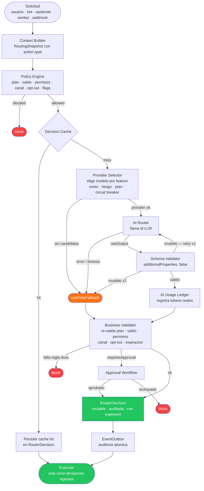
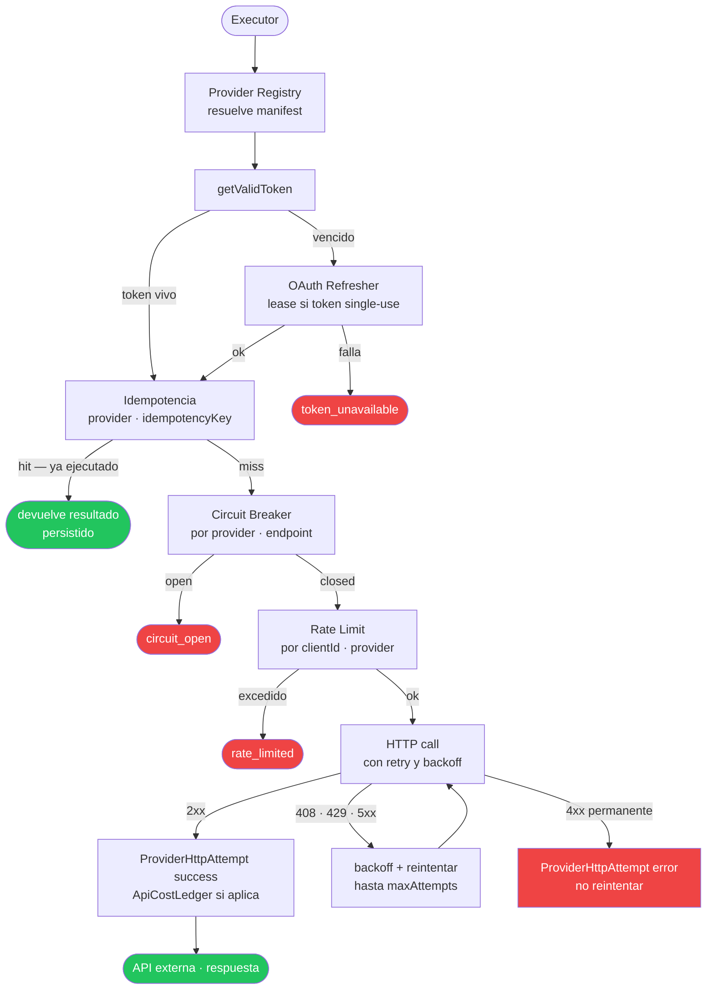
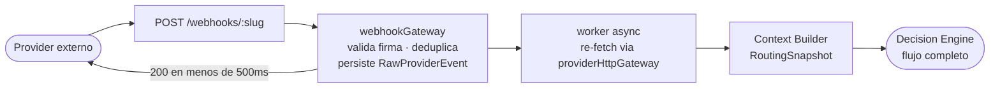

# Safe Automation Control Plane

Arquitectura open-source para automatizaciones seguras con IA: cuatro protocolos
complementarios que juntos forman una capa de control para plataformas que automatizan
acciones con impacto real.

La idea central:

```txt
Las reglas definen que esta permitido.
La IA optimiza dentro de lo permitido.
La plataforma valida antes de ejecutar.
El gateway outbound controla las llamadas al mundo externo.
```

---

## Los cuatro protocolos

| Protocolo | Responsabilidad | Documento |
|---|---|---|
| **AI Routing Decision Engine** | Decide si una accion puede avanzar, con que riesgo y estrategia | [protocolo →](./protocol-decision-engine.md) |
| **AI Model Layer** | Define como se comporta la IA: que puede proponer, que no puede hacer, como se eligen modelos | [protocolo →](./protocol-ai-model-layer.md) |
| **Provider Outbound Gateway** | Ejecuta llamadas a APIs externas de forma idempotente, limitada y auditable | [protocolo →](./protocol-provider-gateway.md) |
| **API Integration** | Receta paso a paso para agregar una nueva API externa al control plane | [protocolo →](./protocol-api-integration.md) |

---

## Flujo completo

### Decision Engine + AI Model Layer



### Provider Outbound Gateway



### Webhooks entrantes



El **Decision Engine** decide qué está permitido.
El **AI Model Layer** razona dentro del slot que el Decision Engine le asigna — nunca toca APIs externas.
El **Provider Gateway** ejecuta la llamada al mundo externo con control total.
El protocolo de **API Integration** explica cómo conectar una nueva API a esta cadena.

---

## La regla global

Nunca:

```txt
IA -> Executor directo
IA -> API externa directo
Módulo de negocio -> axios/fetch directo -> Provider externo
Asistente interno -> API externa directo
```

Siempre:

```txt
Acción → Decision Engine → Executor → Provider Gateway → API externa
```

---

## Flujo de implementacion recomendado

### Primer corte — seguridad antes que inteligencia

- Policy Engine con reglas duras.
- `RouterDecision` model + schema.
- `ruleOnlyFallback` — el motor opera sin IA desde el día uno.
- `ProviderAccount` + Provider Registry + manifests.
- `ProviderHttpAttempt` + `providerHttpGateway`.
- Endpoint de simulacion.

Resultado: la plataforma puede bloquear o permitir de forma conservadora,
sin depender de IA ni de ejecucion automatica.

### Segundo corte — IA controlada

- AI Router + Provider Selector.
- Decision Cache.
- AI Usage Ledger + Circuit Breaker.
- Schema Validator estricto.
- Business Validator completo.
- Approval Workflow.

Resultado: la IA recomienda, pero las reglas y validadores siguen teniendo la ultima palabra.

### Tercer corte — llamadas externas controladas

- Token refresh provider-specific con lease si el provider rota tokens.
- Rate limits por tenant/provider.
- Circuit breakers.
- Cost ledger externo.
- Workers idempotentes con DLQ.
- Modo advisory → enforced por canal estable.

Resultado: el executor llama providers externos sin perder control operativo.

---

## Modos de rollout

| Modo | Comportamiento | Cuándo usar |
|---|---|---|
| `simulation` | Calcula riesgo y costo, no ejecuta | Development, QA |
| `shadow` | Llama al modelo, registra, no afecta producción | Validar calidad antes de advisory |
| `advisory` | Sugiere, humano aprueba, executor espera | Rollout inicial, features nuevas |
| `enforced` | Puede ejecutar sin aprobación si validaciones pasan | Solo features maduras con tests |

Regla: canales experimentales o nuevos arrancan en `shadow`. Nunca `enforced` desde el primer día.

---

## Repos de cada protocolo

- [AI-Routing-Decision-Engine](https://github.com/cristiandkzk/AI-Routing-Decision-Engine) — motor de decisiones con tests y simulacion
- [Provider-Outbound-Gateway](https://github.com/cristiandkzk/Provider-Outbound-Gateway) — documentacion del gateway
- [Safe-Automation-Control-Plane](https://github.com/cristiandkzk/Safe-Automation-Control-Plane) — este repo (indice de protocolos)

---

## Licencia

MIT.

---

## Regla final

```txt
Las reglas deciden que esta permitido.
La IA optimiza dentro de lo permitido.
Los validadores deciden que puede ejecutarse.
El executor ejecuta solo decisiones vigentes.
El gateway outbound controla toda llamada al mundo externo.

Quien origina la decision no importa:
  un usuario, un bot, un asistente IA o un worker
  siempre pasan por el mismo motor.
```
