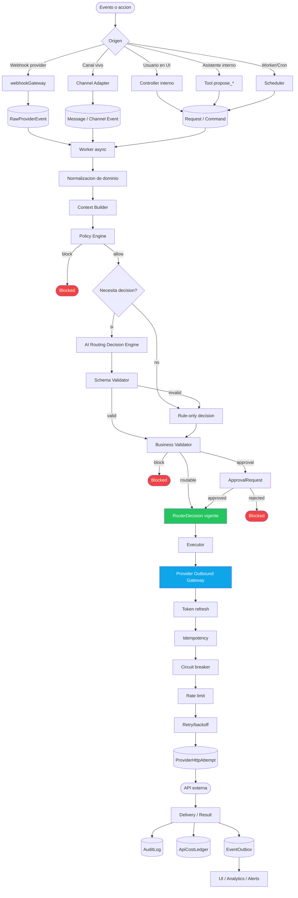

# Vertical Flow Example

Ejemplo concreto del flujo vertical completo de una accion bajo el Safe Automation
Control Plane: desde que entra un evento hasta que se ejecuta una llamada externa,
pasando por validacion, decision, aprobacion y auditoria.

Este documento aplica los cuatro protocolos del repo:

- [Decision Engine](./protocol-decision-engine.md) — quien decide.
- [AI Model Layer](./protocol-ai-model-layer.md) — como participa la IA.
- [Provider Outbound Gateway](./protocol-provider-gateway.md) — como sale al mundo.
- [API Integration](./protocol-api-integration.md) — como se agrega una API nueva.

La idea central:

```txt
Entrada normalizada.
Decision validada.
Ejecucion controlada.
Auditoria completa.
```

## Vista vertical

```txt
Usuario / Cliente final / Provider externo
  v
Canal de entrada
  v
Webhook Gateway / Channel Adapter
  v
Evento crudo persistido
  v
Worker async
  v
Normalizacion de dominio
  v
Context Builder
  v
Policy Engine
  v
AI Routing Decision Engine
  v
Business Validator
  v
Approval Workflow si corresponde
  v
Executor
  v
Provider Outbound Gateway
  v
API externa / canal final
  v
Delivery tracking
  v
AuditLog + CostLedger + EventOutbox
  v
UI / Analytics / Observability
```

## Flujo completo



## Capas

### 1. Entrada

Responsabilidad:

```txt
recibir eventos externos o acciones internas
validar origen
persistir crudo
responder rapido
procesar async
```

Entradas posibles:

```txt
Webhook de Meta WhatsApp / Instagram
Webhook de marketplace (MercadoLibre, eBay, etc.)
Mensaje en canal no oficial (Baileys, sockets)
Accion del usuario en UI
Propuesta del asistente interno (tool propose_*)
Cron / scheduler
Worker de retry
```

Piezas:

```txt
webhookGateway
RawProviderEvent
Channel Adapter
EventOutbox
workers
```

Regla:

```txt
El webhook no ejecuta negocio pesado.
Persiste, responde 200 y delega al worker.
```

## 2. Normalizacion

Responsabilidad:

```txt
convertir payload externo en objetos internos
resolver tenant
resolver provider account
crear o actualizar cliente/conversacion/solicitud/producto
deduplicar eventos
```

Ejemplos:

```txt
Meta message            -> Conversation + Message
Instagram event         -> InstagramEvent
MercadoLibre question   -> MarketplaceQuestion
MercadoLibre publish    -> MarketplaceListing
Campaign request        -> RoutingSnapshot (forCampaignSend)
Asistente propone       -> RoutingSnapshot (forInboundReply / forContentPublish)
Intake financiero       -> FinanceIntake
```

Modelos frecuentes:

```txt
ProviderAccount
Customer
Conversation
InstagramEvent
MarketplaceQuestion
MarketplaceListing
Request
CampaignPlan
FinanceIntake
```

## 3. Context Builder

Responsabilidad:

```txt
armar un snapshot pequeno, seguro y estable
excluir tokens y secretos
resumir datos relevantes
calcular costo estimado si aplica
calcular risk flags
calcular capacidades del canal
```

Ejemplo de snapshot:

```txt
clientId
sourceModule
sourceType
sourceId
action.type
mode
plan
channel
provider
message fingerprint
destination summary
cost estimate
risk score
feature flags
operational state
```

Regla:

```txt
La IA recibe contexto resumido, no payloads crudos innecesarios.
```

## 4. Decision

Responsabilidad:

```txt
decidir si la accion puede avanzar
usar reglas antes que IA
usar cache cuando el contexto no cambio
llamar IA solo si aporta valor
validar output con schema
revalidar negocio
persistir decision auditable
```

Piezas:

```txt
Policy Engine
AI Routing Decision Engine
routerDecision.schema
ruleOnlyFallback
Business Validator
RouterDecision
AiUsageEvent
AiAvoidedUsageEvent
```

Decisiones posibles:

```txt
allow
block
require_approval
split
defer
allow_auto
deny
```

Regla:

```txt
La IA no ejecuta.
La IA propone dentro de lo permitido.
El Business Validator tiene la ultima palabra.
```

### Dos entry points para la IA

Convive una distincion importante para no confundir capas:

```txt
routingDecision.service.decide(snapshot)
  -> orquesta Policy + Cache + Selector + AI + Schema + Business + Approval
  -> persiste RouterDecision con state machine
  -> es lo que se usa para acciones sensibles (envios, publicaciones,
     respuestas a clientes, decisiones con riesgo o costo)

aiGateway.chatJson({ feature, systemPrompt, userInput })
  -> entry point universal para llamadas IA simples sin state machine
  -> encapsula cache + selector + breaker + ledger
  -> se usa para: drafts internos del asistente, extraccion de datos
     (intake financiero), clasificacion de intent, summarization
  -> nunca llama un provider externo, solo el LLM
```

Regla:

```txt
Si la salida de la IA afecta una accion sensible
  -> routingDecision.service
Si la salida de la IA es solo un texto/objeto interno
  -> aiGateway.chatJson
```

### Structured Outputs (enforce de schema a nivel de tokens)

Los providers modernos (Groq, OpenRouter compatible, OpenAI) aceptan:

```txt
response_format: { type: 'json_schema', json_schema: { strict: true, ... } }
```

Esto garantiza la estructura del output a nivel de la API — el modelo no puede
devolver campos extra, faltantes, ni con tipos equivocados. El Schema Validator
del motor sigue corriendo despues para validar semantica (rangos, enums
cerrados, fechas en el pasado), pero los fallos por estructura malformada
practicamente desaparecen.

Tanto el orquestador del Decision Engine como el entry point simple deberian
exportar esta opcion para que el caller pase un JSON Schema strict cuando
corresponda.

### Provider preferences (ahorro automatico)

Cuando se usa un proxy de modelos (ej. OpenRouter) y un modelo tiene varios
backends que lo sirven, se puede pasar:

```txt
provider: { sort: 'price' }
```

El proxy elige el backend mas barato sin afectar la decision ni la calidad
del output. Buena practica: aplicarlo automaticamente cuando el candidato
seleccionado es de tier `cheap` (las decisiones de bajo riesgo no necesitan
el backend mas rapido).

Tambien se pueden usar allowlists/denylists para forzar residencia de datos
o cumplir requisitos de compliance.

## 5. Approval

Responsabilidad:

```txt
pedir revision humana cuando el riesgo o la politica lo exige
mostrar contexto suficiente
guardar quien aprobo/rechazo
evitar que el executor avance sin approval valido
```

Piezas:

```txt
ApprovalRequest
approval.service
AuditLog
UI de approvals
```

Casos tipicos:

```txt
responder pregunta de marketplace
publicar producto
contestar comentario sensible
enviar campania masiva
publicar post/reel
usar canal experimental
```

Regla:

```txt
Si requiresApproval = true, el executor no ejecuta hasta que ApprovalRequest este approved.
```

## 6. Ejecucion

Responsabilidad:

```txt
consumir una decision vigente
no recalcular la decision
validar idempotencia
llamar al provider externo por gateway
persistir resultado
emitir eventos
```

Piezas:

```txt
Executor / worker
Provider Outbound Gateway
providerAccount.getValidToken
providerRateLimit
providerBreaker
ProviderHttpAttempt
ApiCostLedger
DeliveryTracker
```

Regla:

```txt
Ningun worker llama APIs externas con axios/fetch directo.
Toda salida externa pasa por providerHttpGateway.call().
```

## 7. Salida externa

Responsabilidad del Provider Outbound Gateway:

```txt
resolver ProviderAccount
obtener access token fresco
aplicar idempotency key
aplicar circuit breaker
aplicar rate limit
hacer retry/backoff
persistir ProviderHttpAttempt
registrar costo si aplica
devolver resultado uniforme
```

Errores esperados:

```txt
token_unavailable
circuit_open
rate_limited
timeout
http_400
http_401
http_403
http_404
http_429
http_500
```

Regla:

```txt
El caller decide que hacer con ok:false.
El gateway no debe romper el flujo con excepciones del provider.
```

## Ejemplo vertical 1: Instagram DM

```txt
1. Usuario envia DM en Instagram.
2. Meta manda webhook al endpoint del provider.
3. webhookGateway valida firma y persiste RawProviderEvent.
4. Worker procesa RawProviderEvent.
5. Se crea InstagramEvent kind=direct_message.
6. Se resuelve ProviderAccount meta_instagram.
7. Context Builder crea RoutingSnapshot action.type=inbound_reply.
8. Policy Engine valida permisos, ventana, opt-out, plan y estado del canal.
9. Decision Engine genera o evita draft.
10. Business Validator decide needs_approval.
11. Se crea ApprovalRequest.
12. Humano aprueba o edita respuesta.
13. Executor carga RouterDecision vigente.
14. instagram.send-worker llama providerHttpGateway.call().
15. Gateway refresca token si hace falta.
16. Gateway usa idempotencyKey ig_reply_<eventId>_<version>.
17. Meta Graph recibe la respuesta.
18. Se guarda ProviderHttpAttempt, providerMessageId y AuditLog.
19. UI muestra estado publicado.
```

## Ejemplo vertical 2: Pregunta de marketplace

```txt
1. Comprador hace pregunta en el marketplace.
2. El marketplace manda notification al endpoint del provider.
3. webhookGateway persiste RawProviderEvent.
4. Worker re-fetch del resource via providerHttpGateway.
5. Se crea MarketplaceQuestion.
6. Context Builder arma snapshot action.type=marketplace_answer_question.
7. Policy Engine valida plan, permisos, producto y estado del provider.
8. Decision Engine genera sugerencia si corresponde.
9. Business Validator decide require_approval.
10. Se crea ApprovalRequest.
11. Usuario aprueba desde UI o WhatsApp.
12. Executor publica respuesta via providerHttpGateway.
13. Gateway usa idempotencyKey ml_question_answer_<questionId>_<answerVersion>.
14. Se guarda ProviderHttpAttempt y MarketplaceQuestion.status=published.
15. AuditLog registra quien aprobo y que se publico.
```

## Ejemplo vertical 3: Propuesta del asistente interno

```txt
1. Operador en el panel: "respondele a pepe123 que si hay talle 43".
2. Asistente recibe mensaje + panelContext (page=/marketplace/questions, selectedItem=q_A3X9P2).
3. Asistente llama tool read_marketplace_question({ id: q_A3X9P2 }).
4. Asistente arma draft via aiGateway.chatJson({ feature: 'marketplace_draft' }).
5. Asistente llama tool propose_marketplace_answer({ questionId, answerText }).
6. La tool invoca marketplaceContext.forAnswerQuestion()
   -> RoutingSnapshot action.type=inbound_reply, sourceModule=marketplace.
7. La tool llama routingDecision.service.decide(snapshot).
8. Policy Engine evalua scope router_ai.inbound_reply.
9. Business Validator decide require_approval.
10. Se crea ApprovalRequest y RouterDecision(state=approval_pending).
11. La tool devuelve { status: 'pending_approval', approvalId, decisionId }.
12. Asistente responde al operador: "La respuesta quedo pendiente de aprobacion (apr_xxx)".
13. Operador aprueba en la UI de approvals.
14. ApprovalRequest -> approved, RouterDecision -> approved -> routable.
15. Executor consume la decision y publica via providerHttpGateway.
16. Idempotency key: ml_question_answer_<externalQuestionId>_<answerVersion>.
17. MarketplaceQuestion.status=published, AuditLog, ApiCostLedger si aplica.
```

Lo que el asistente NO hace:

```txt
ejecutar la respuesta por su cuenta
aprobar sus propias propuestas
saltar el Policy Engine
llamar al marketplace directo
```

## Ejemplo vertical 4: Campania WhatsApp Meta

```txt
1. Usuario crea campania.
2. campaignRouting.service arma RoutingSnapshot action.type=campaign_send.
3. Cost estimator calcula estimatedCost en moneda local.
4. Policy Engine valida plan, saldo, opt-out y canal.
5. Decision Engine optimiza tandas/demoras si aporta valor.
6. Business Validator exige saldo/reserva y decision vigente.
7. Si requiere aprobacion, se crea ApprovalRequest.
8. Scheduler encola batches.
9. Worker ejecuta cada batch con RouterDecision vigente.
10. Cada mensaje sale por providerHttpGateway.
11. Gateway usa idempotencyKey meta_wa_message_<conversationId>_<messageId>.
12. Meta Graph recibe template/message.
13. Delivery webhook vuelve por webhookGateway.
14. DeliveryTracker actualiza estado.
15. ApiCostLedger y MetaCostLedger registran costo.
```

## Tabla de responsabilidad

| Capa | Decide | Ejecuta | Persiste | No debe hacer |
|---|---|---|---|---|
| webhookGateway | No | No | RawProviderEvent | Procesar negocio pesado |
| Worker inbound | No | Normaliza | Modelos dominio | Llamar provider externo directo |
| Policy Engine | Reglas duras | No | Policy result | Llamar IA |
| Decision Engine | Decision validada | No | RouterDecision | Enviar/publicar |
| ApprovalService | Gate humano | No | ApprovalRequest | Modificar provider |
| Executor | No recalcula | Si | Resultado dominio | Ignorar decision expirada |
| Provider Gateway | No decide negocio | Llama API externa | ProviderHttpAttempt | Saltar idempotencia |
| Audit/Cost | No | No | AuditLog/ApiCostLedger | Contener tokens |

## Action types sugeridos

```txt
campaign_send
inbound_reply
content_publish
comment_moderate
social_publish
meta_template_send
marketplace_catalog_suggest
marketplace_answer_question
marketplace_publish_product
marketplace_update_listing
marketplace_sync_stock
mail_transactional_send
payment_capture
ocr_process_document
```

## Idempotency keys sugeridas

```txt
Meta WhatsApp:
  meta_wa_message_<conversationId>_<messageId>

Instagram reply:
  ig_reply_<eventId>_<answerVersion>

Instagram moderation:
  ig_comment_hide_<eventId>_<moderationVersion>

Social publish:
  social_publish_<postId>_<version>

MercadoLibre answer:
  ml_question_answer_<externalQuestionId>_<answerVersion>

MercadoLibre stock:
  ml_stock_sync_<externalItemId>_<newStock>_<version>

MercadoLibre publish:
  ml_publish_item_<productId>_<draftVersion>
```

## Migrar un caller IA existente al control plane

Cuando hay codigo legacy que llama el SDK del provider (Groq, OpenAI, axios)
directo, la migracion sigue tres patrones segun la complejidad del caller.

Lo importante es no romper comportamiento: tests de regresion ANTES de migrar.

### Patron 1 — Single-shot sin tools

Cuando el caller pide una sola respuesta JSON o texto: extraer datos,
clasificar intent, draftear un mensaje, generar contenido.

```txt
Caller legacy (anti-patron):
  const client = new ProviderSDK({ apiKey: process.env.PROVIDER_KEY });
  const completion = await client.chat.completions.create({...});
  const text = completion.choices[0].message.content;

Migracion correcta:
  const result = await aiGateway.chatJson({
    clientId, feature, sourceModule, sourceType, sourceId,
    systemPrompt, userInput,
    riskLevel: 'low' | 'medium' | 'high',
    jsonSchema: STRICT_SCHEMA,   // estructura garantizada a nivel de tokens
    promptVersion, schemaVersion,
    disableCache: true,           // si la respuesta es conversacional o unica
  });
  if (result.error) { /* fallback aplicable al dominio */ }
  return result.output;

Lo que sale gratis (sin escribir codigo):
  - providerSelector elige modelo por feature/riesgo/plan.
  - circuit breaker salta provider caido.
  - fallback a un segundo proveedor (si el primario falla).
  - AiUsageEvent automatico (analytics granular).
  - structured outputs strict (si pasas jsonSchema).
  - provider preferences price-first cuando el candidato es tier 'cheap'.
```

### Patron 2 — Loop con tool calling

Cuando el caller necesita un loop iterativo donde el LLM puede invocar
funciones (asistente conversacional, bot que consulta tools).

```txt
Por que NO sirve un entry point single-shot:
  - El loop necesita messages[] con history + tool_calls + tool_results
    intercalados, no un userInput plano.
  - Los tool_call_id no son portables entre providers.
    Si el provider A devuelve tc_abc y al fallar pasas el array de messages
    al provider B, B no reconoce ese ID. El loop se rompe.

Patron correcto:
  - El loop vive local en el caller.
  - Reusa providerSelector + circuit breaker + usage ledger como librerias
    (no llama al entry point single-shot).
  - El fallback se hace al INICIO de cada iteracion (cuando todavia no
    hay tool_call_ids comprometidos), no DENTRO de ella.
  - Cada iteracion genera un AiUsageEvent separado con
    requestId = `<caller>_<sessionId>_iter<N>`.
```

### Patron 3 — Decision con state machine

Cuando la salida de la IA tiene que afectar una accion sensible (envio
masivo, publicacion externa, respuesta a un cliente).

```txt
No usar el entry point single-shot — usar el Decision Engine.

  const decision = await routingDecision.service.decide(snapshot);
  // -> Policy + Cache + Selector + AI + Schema + Business + Approval
  // -> persiste RouterDecision con state machine
  // -> el executor no avanza hasta que la decision sea routable
```

### Tests de regresion antes de migrar

Patron probado en migraciones reales:

```txt
1. Identificar los comportamientos criticos del caller actual:
   - happy path
   - fallback / degradacion
   - limites del plan (si aplica)
   - errores recuperables vs throw
   - branches del control flow (con/sin tools, etc.)

2. Escribir tests que mockeen las dependencias externas (HTTP, SDK)
   y validen los comportamientos observables.

3. Correr los tests CONTRA EL CODIGO ACTUAL. Verde antes de tocar.

4. Migrar. Actualizar los mocks (cambian los puntos de inspeccion,
   no los comportamientos esperados).

5. Correr los tests CONTRA EL CODIGO NUEVO. Verde despues de migrar
   = cero regresiones de comportamiento.

6. Borrar el codigo legacy.
```

Los tests son tests de COMPORTAMIENTO, no de implementacion. Migrar de
`providerSDK.chat.completions.create` a `aiGateway.chatJson` cambia los puntos
de mock — el contrato observable del caller no cambia.

## Definition of Done vertical

Una feature vertical esta completa cuando:

- [ ] La entrada esta normalizada.
- [ ] Webhooks entran por `webhookGateway`.
- [ ] Eventos crudos quedan en `RawProviderEvent`.
- [ ] Existe `RoutingSnapshot` o snapshot equivalente.
- [ ] Acciones sensibles pasan por `AI Routing Decision Engine`.
- [ ] Existe `RouterDecision` persistida.
- [ ] Aprobaciones usan `ApprovalRequest`.
- [ ] El executor valida decision vigente.
- [ ] Salidas externas pasan por `providerHttpGateway`.
- [ ] Hay idempotency key estable.
- [ ] Hay `ProviderHttpAttempt`.
- [ ] Costos quedan en `ApiCostLedger` si aplica.
- [ ] AuditLog no contiene tokens ni secretos.
- [ ] UI muestra estado y error recuperable.
- [ ] Tests cubren policy block, token vencido, retry, idempotencia y approval.

## Regla final

```txt
Entrada por gateway.
Decision por control plane.
Approval si hace falta.
Salida por gateway.
Auditoria siempre.
```
